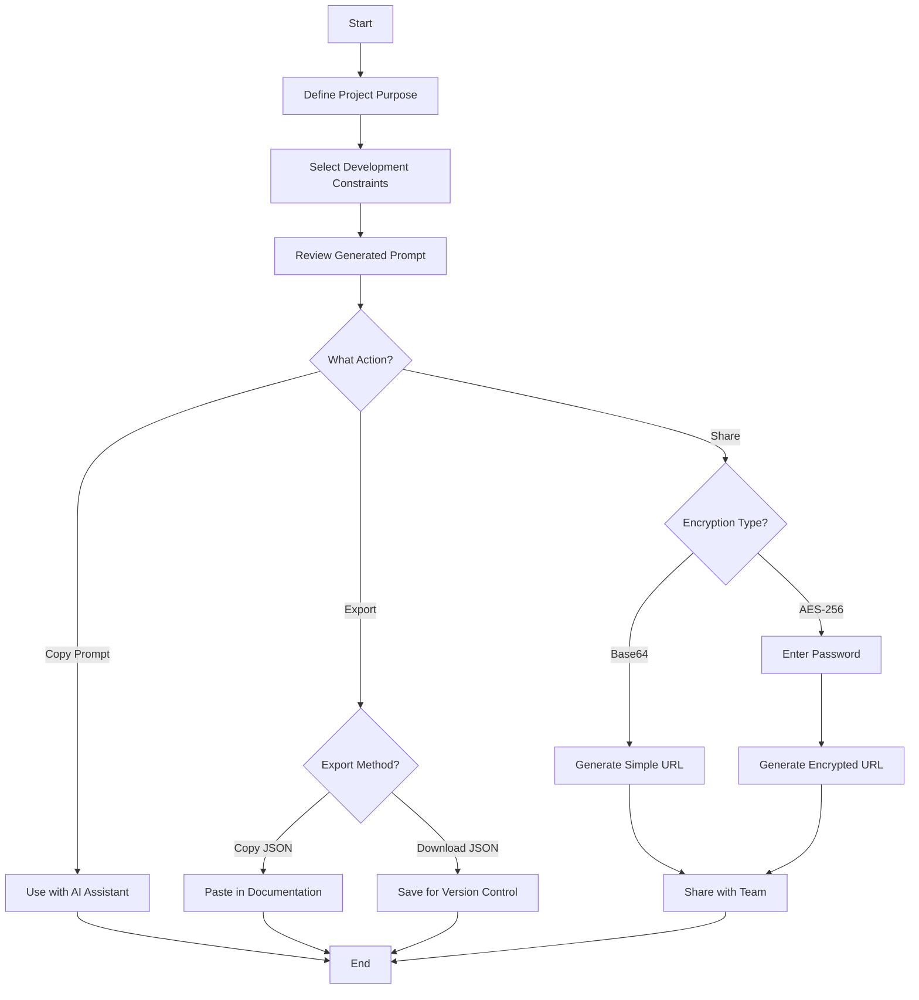
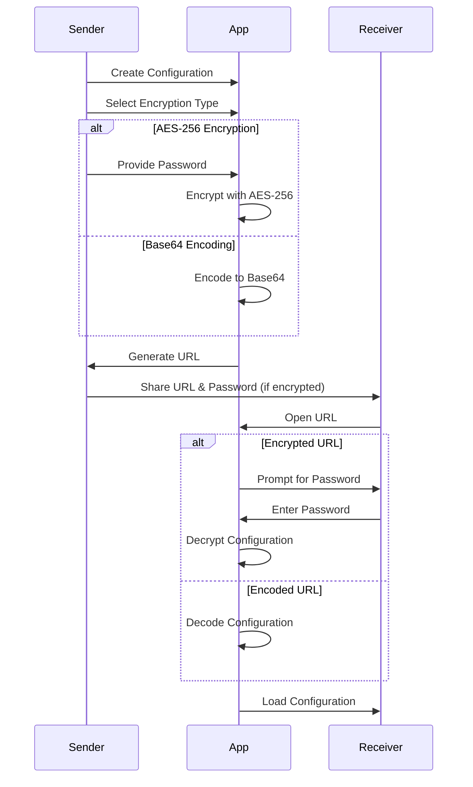
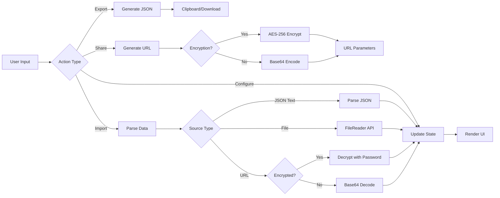

# xsukax Web App AI Prompt Share


A privacy-focused, client-side web application for generating, managing, and sharing AI prompt configurations for web development projects. Built entirely with vanilla JavaScript, this tool enables developers to create structured prompts with customizable constraints and guidelines, then share them securely via encrypted or encoded URLs.

🔗 **Live Demo**: [https://xsukax.github.io/xsukax-Web-App-AI-Prompt-Share/](https://xsukax.github.io/xsukax-Web-App-AI-Prompt-Share/)

## Table of Contents

- [Project Overview](#project-overview)
- [Security and Privacy Benefits](#security-and-privacy-benefits)
- [Features and Advantages](#features-and-advantages)
- [Installation Instructions](#installation-instructions)
- [Usage Guide](#usage-guide)
- [Architecture](#architecture)
- [License](#license)

## Project Overview

xsukax Web App AI Prompt Share is a lightweight, single-page application designed to streamline the process of creating and sharing AI prompts for web development projects. The application allows developers to:

- Define the main purpose of their web application project
- Select from pre-configured development guidelines and constraints (responsive design, Tailwind CSS, accessibility features, performance optimization, etc.)
- Generate formatted prompts that can be directly used with AI assistants
- Export configurations as JSON files for backup and version control
- Share configurations via shareable URLs with optional AES-256 encryption
- Import previously saved configurations for reuse and collaboration

The tool is particularly useful for teams working with AI-assisted development, enabling consistent prompt engineering practices and facilitating knowledge sharing across projects.

## Security and Privacy Benefits

### Complete Client-Side Processing

All data processing occurs entirely within the user's browser with zero server-side dependencies. No configuration data, prompts, or user inputs are ever transmitted to external servers during normal operation, ensuring complete control over sensitive project information.

### Optional AES-256 Encryption

When generating shareable URLs, users can choose between two security models:

1. **Base64 Encoding**: Provides basic obfuscation for non-sensitive configurations, making URLs human-unreadable while remaining easily decodable
2. **AES-256 Encryption**: Implements industry-standard encryption with user-defined passwords, ensuring that shared configurations remain confidential and can only be accessed by recipients with the correct decryption key

### No External API Dependencies

The application operates completely offline-capable (after initial load) and does not rely on third-party APIs, eliminating potential data leakage vectors and ensuring availability regardless of external service status.

### Transparent Data Handling

All configuration data is stored and transmitted as JSON, allowing users to inspect, audit, and verify exactly what information is being shared or exported. The open-source nature of the project enables security audits and community verification of privacy practices.

### Local Storage Options

Users maintain full control over their data through multiple export mechanisms (clipboard copy, JSON file download, shareable URLs), with no forced cloud storage or account creation requirements.

## Features and Advantages

### Core Functionality

- **Comprehensive Checklist**: pre-configured development guidelines covering modern web development practices including SVG usage preferences, responsive design, CSS frameworks, accessibility, performance optimization, and more
- **Dynamic Prompt Generation**: Real-time generation of formatted prompts based on selected constraints and project purpose
- **Flexible Export Options**: Export configurations as formatted JSON files or copy directly to clipboard
- **Secure Sharing**: Generate shareable URLs with optional password-protected encryption
- **Import Capabilities**: Import configurations from JSON text, uploaded files, or URL parameters
- **Responsive Design**: Fully functional across desktop, tablet, and mobile devices

### User Experience

- **Zero Setup**: No installation, registration, or configuration required—works immediately in any modern browser
- **Intuitive Interface**: Clean, professional UI built with Tailwind CSS featuring smooth animations and transitions
- **Keyboard Support**: Enter key support in password fields for streamlined workflows
- **Visual Feedback**: Toast-style notifications for all user actions (copy, import, export, errors)
- **Modal Dialogs**: Elegant CSS-based modals instead of intrusive browser alerts

### Technical Advantages

- **Lightweight**: Single HTML file with minimal external dependencies (Tailwind CSS CDN, CryptoJS)
- **Modern JavaScript**: Written using ES6+ features including arrow functions, async/await, and destructuring
- **No Build Process**: Direct deployment without compilation, bundling, or transpilation steps
- **Progressive Enhancement**: Graceful fallback for clipboard operations in older browsers
- **Maintainable Code**: Well-structured, commented code with clear separation of concerns

### Collaboration Benefits

- **Version Control Friendly**: JSON export format integrates seamlessly with Git workflows
- **Team Sharing**: Encrypted URLs enable secure distribution of project configurations across team members
- **Consistency**: Standardized prompt structures ensure uniform AI interactions across projects
- **Documentation**: Generated prompts serve as self-documenting project constraints

## Installation Instructions

### Option 1: Direct Download (Recommended)

1. Download the `index.html` file from the repository:
   ```bash
   wget https://raw.githubusercontent.com/xsukax/xsukax-Web-App-AI-Prompt-Share/main/index.html
   ```

2. Open the file in any modern web browser:
   ```bash
   # On macOS
   open index.html
   
   # On Linux
   xdg-open index.html
   
   # On Windows
   start index.html
   ```

### Option 2: Clone Repository

```bash
git clone https://github.com/xsukax/xsukax-Web-App-AI-Prompt-Share.git
cd xsukax-Web-App-AI-Prompt-Share
```

Then open `index.html` in your preferred web browser.

### Option 3: Serve Locally

For development or testing with a local server:

```bash
# Using Python 3
python -m http.server 8000

# Using Node.js (http-server package)
npx http-server

# Using PHP
php -S localhost:8000
```

Navigate to `http://localhost:8000` in your browser.

### System Requirements

- **Browser**: Any modern web browser with ES6+ JavaScript support
  - Chrome 51+
  - Firefox 54+
  - Safari 10+
  - Edge 15+
- **Internet Connection**: Required only for initial CDN resource loading (Tailwind CSS, CryptoJS)
- **Operating System**: Platform-independent (Windows, macOS, Linux, mobile)

## Usage Guide

### Basic Workflow

#### Step 1: Define Project Purpose

Enter a clear description of your web application's main purpose in the "Main Purpose" text area. This provides context for the AI assistant about your project goals.

**Example:**
```
Create a task management dashboard with real-time collaboration features, 
allowing teams to organize projects, assign tasks, and track progress.
```

#### Step 2: Select Development Constraints

Review the 34 available development guidelines and check those applicable to your project. Common selections include:

- **Responsive design** across common devices
- **Tailwind CSS** for styling
- **Modern ES6+** JavaScript features
- **Semantic HTML** elements
- **Performance optimization**

#### Step 3: Review Generated Prompt

The application automatically generates a formatted prompt combining your purpose statement and selected constraints. This prompt appears in the "Generated Prompt" section and updates in real-time as you make changes.

#### Step 4: Copy and Use

Click the "Copy to Clipboard" button to copy the generated prompt, then paste it into your AI assistant conversation to provide structured project context.

### Advanced Features

#### Exporting Configurations

1. Click "Export Config" button in the header
2. Review the JSON configuration in the modal dialog
3. Choose from three options:
   - **Copy JSON**: Copy to clipboard for pasting elsewhere
   - **Download JSON**: Save as `xsukax-config.json` file
   - **Close**: Return without taking action

**JSON Structure:**
```json
{
  "purpose": "Your project description",
  "checklist": [
    {
      "id": 1,
      "text": "Guideline description",
      "checked": true
    }
  ]
}
```

#### Importing Configurations

1. Click "Import Config" button in the header
2. Choose import method:
   - **Paste JSON**: Copy JSON text into the textarea
   - **Upload JSON File**: Click "Upload JSON File" and select your `.json` file
3. Click "Import" to apply the configuration
4. Review the loaded settings and make any necessary adjustments

#### Generating Shareable URLs

1. Click "Generate Shareable URL" button
2. Select encryption type:
   - **Base64 Encoded URL**: Simple encoding (no password required)
   - **AES-256 Encrypted URL**: Secure encryption (requires password)
3. If using encryption, enter a strong password
4. Click "Generate URL" to create the shareable link
5. Choose action:
   - **Copy URL**: Copy the link to clipboard
   - **Open URL**: Open in new browser tab to verify

**Security Recommendation**: Always use AES-256 encryption with strong passwords when sharing configurations containing proprietary project information.

#### Loading from Shared URLs

When receiving a shareable URL:

1. Open the URL in your web browser
2. For encrypted URLs, you'll be prompted to enter the decryption password
3. Enter the password provided by the sender
4. Click "Decrypt" to load the configuration
5. Review and modify the loaded settings as needed

### Workflow Diagram



### Configuration Sharing Flow



### Tips and Best Practices

1. **Version Control**: Export configurations as JSON files and commit them to your project repository for tracking prompt evolution over time
2. **Team Standards**: Create standardized configurations for different project types (landing pages, dashboards, e-commerce, etc.) and share them across your team
3. **Security First**: Always use AES-256 encryption when sharing configurations that contain sensitive project details or proprietary information
4. **Descriptive Purposes**: Write detailed purpose statements—the more context you provide, the better the AI can assist with your project
5. **Regular Updates**: Periodically review and update your constraint selections as project requirements evolve
6. **Password Management**: Use strong, unique passwords for encrypted URLs and share them through secure channels (not in the same communication as the URL)

## Architecture

### Technology Stack

- **HTML5**: Semantic markup structure
- **CSS3**: Styling via Tailwind CSS CDN
- **JavaScript (ES6+)**: Client-side logic and interactivity
- **CryptoJS**: AES-256 encryption library for secure URL sharing

### Data Flow



### Key Components

1. **State Management**: In-memory JavaScript object (`checklistItems`) maintains application state
2. **Event Handling**: Event delegation and direct event listeners manage user interactions
3. **URL Parameters**: Query string parameters enable configuration sharing via URLs
4. **Modal System**: CSS-based modal dialogs for import/export/share workflows
5. **Notification System**: Toast-style notifications for user feedback

## License

This project is licensed under the GNU General Public License v3.0.

---

**Repository**: [https://github.com/xsukax/xsukax-Web-App-AI-Prompt-Share](https://github.com/xsukax/xsukax-Web-App-AI-Prompt-Share)

**Issues & Contributions**: For bug reports, feature requests, or contributions, please visit the GitHub repository and open an issue or pull request.
